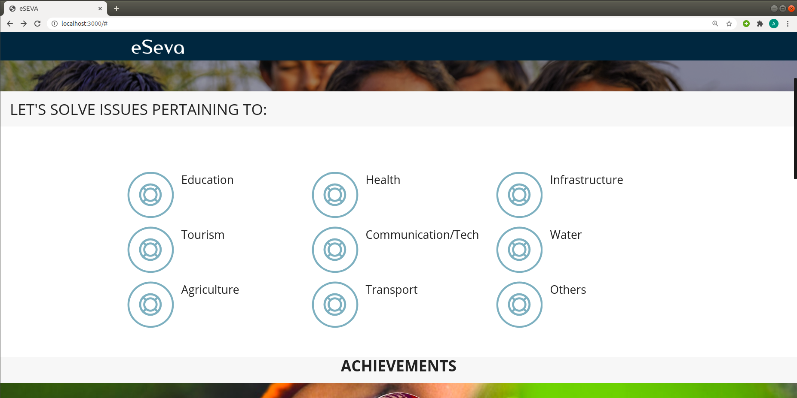
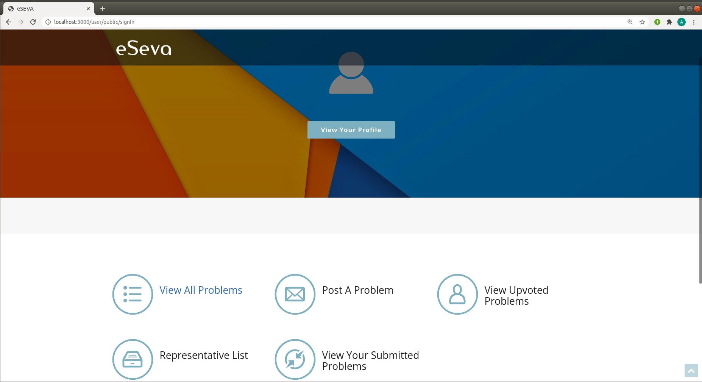
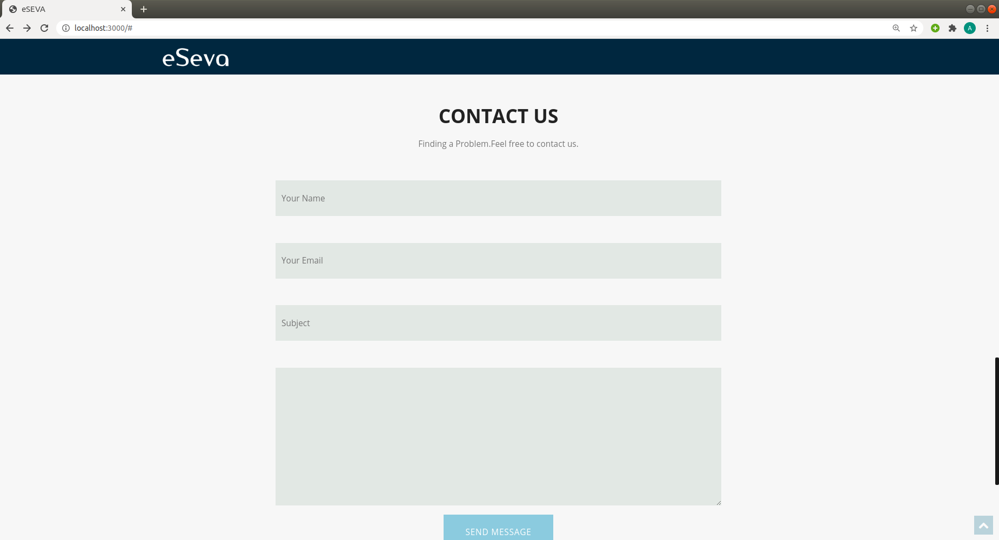

#  e-Seva Portal
   ### A public grievance portal for efficient management of public resources

    
    A web application to effectively manage a public grievance portal where people 
    can raise issues that concerns public authority, can upvote them and can also view 
    their request status

### Application home page 

 
  

     This is the home page of application from where we can navigate to login and signup  
     Also this application has features to get updates on various parameters Like health, education etc.

  

### Profile page 

 
  

    Here we can view all the problems and upvote them as well  
    Also the user can post a problem in the problem list.  
    This page has also a feature to view the representative list of the current area

  

### Contact page 

 
  

    Also this feature have a feature to contact the authorities as an  
    anonymous person .

  

###     Technologies used: HTML, CSS, JavaScript, jQuery, Node.js, MongoDB

